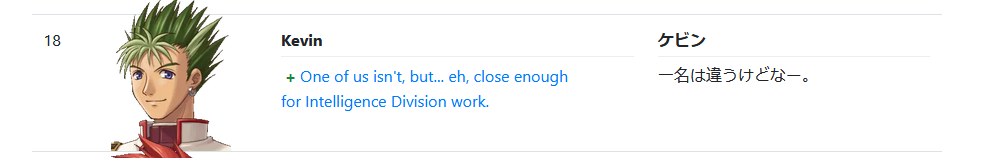
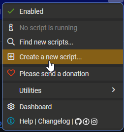
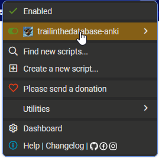

# trailinthedatabase-anki-patch

Patch your last anki note to add the selected sound from trailinthedatabase.com

## How to Install

### AnkiConnect

Install the anki-connect plugin (https://ankiweb.net/shared/info/2055492159).

### Script

#### 1.
Download the **tampermonkey** extension or an equivalent:
- Chrome: https://chrome.google.com/webstore/detail/tampermonkey/dhdgffkkebhmkfjojejmpbldmpobfkfo?hl=en
- Firefox: https://addons.mozilla.org/en-US/firefox/addon/tampermonkey/

#### 2.

  
Click on the extension, then <b>Create New Script</b>

  

#### 3.
Copy & paste the content of the [trailinthedatabase-anki-patch.user.js](./trailinthedatabase-anki-patch.user.js) file, and save it

#### 4.
Update parameters to your environment
- Ankiconnect address
- Name of audio the field on your note

#### 5.

  
Now you can go on <a href="https://trailinthedatabase.com/">https://trailinthedatabase.com/</a> and toggle the script by clicking on the icon

  

